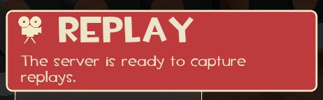
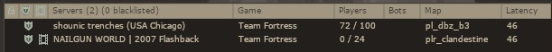
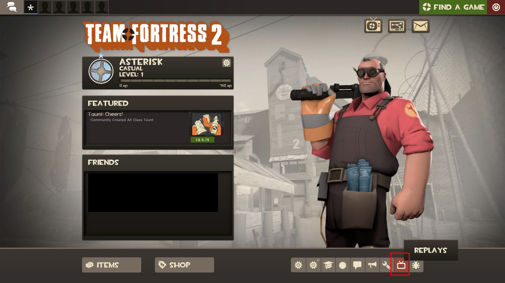
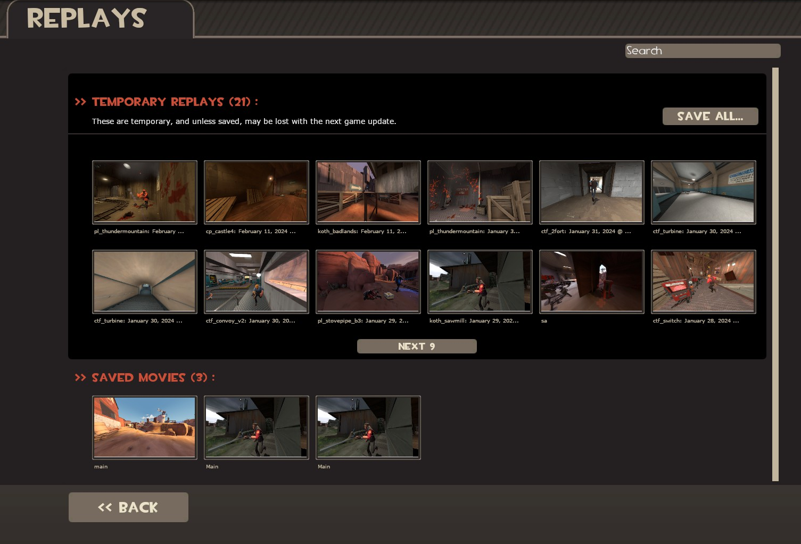
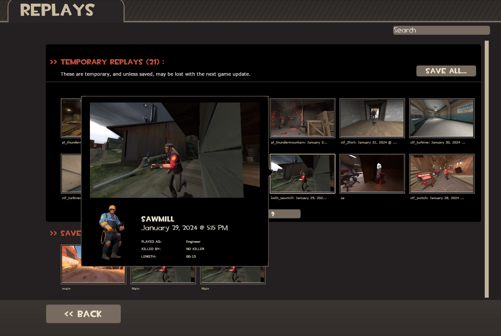
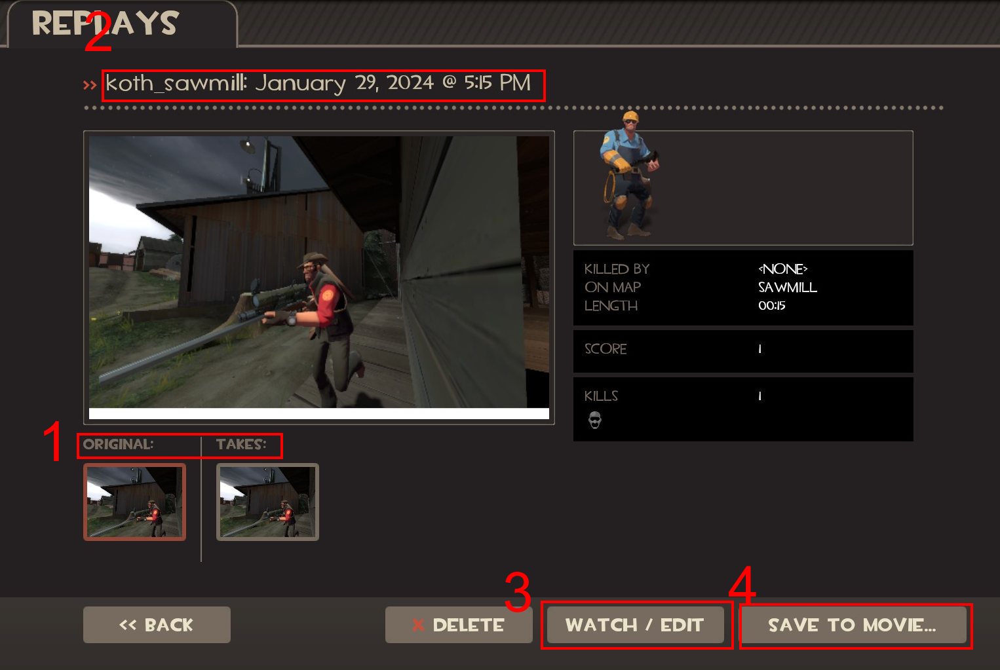
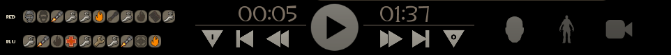

# :material-video-vintage: Replays

!!! warning
    Replays only work on servers that support them. The game will tell you when loading in to a match if this is the case.
    
    

    

    Also look for  in the serverlist. 
    
    

    Offline games will always have replay support.

## :material-camera-plus: Creating a replay

Press ++f6++ while alive to record and save a replay after death.

Press ++f6++ after death to save your life as a replay.

## :material-monitor-eye: Viewing Replays

Replays can be viewed by pressing the **Replays** button on the main menu (the TV).
<!-- No I haven't played at all on the official servers. -->


The **Replay Editor** will show off your replays and saved movies.



Hovering over a replay will show more info:



Clicking on a replay offers a few options:



<div class="annotate" markdown>
1. **Originals and Takes** (1)
2. **Replay Title** (2)
3. **Watch/Edit** (3)
4. **Save To Movie** (4)
</div>

1. The original replay and any takes you've made.
2. This can be clicked on and edited.
3. View your replay in the [**Replay Editor**](#editing-replays).
4. **[Export](#exporting-replays)** your take (select a take or the whole movie first).

You can also see stats like who you played as, movie time, map name, kill count and classes killed.

??? question "How does this replay system work?"
    These replays need to be exported because they are **[not videos](https://developer.valvesoftware.com/wiki/DEM_(file_format))**. They basically load up the map, and have the demo player recreate your (and others') *exact* actions (what it's really recording).

## :solar-clapperboard-open-bold: Editing Replays

Once the replay loads, the prompt on the screen will tell you you can press ++space++ to pause the replay.

You will see something like this (Credit: TF2 wiki):



In the center you have, from left to right:
<div class="annotate" markdown>
1. **In Point** (1)
2. **Rewind to Start** (4)
3. **Rewind by 10 sec.** (2)
4. **Fast Forward** (3)
5. **Skip to end** (5)
6. **Out Point** (6)
</div>

1. Set the start of a take. (++space++)
2. Rewinding is different than fast-forwarding and requires reloading the demo, so you can only rewind through set intervals.
3. Hold down to fast forward, the fast forward will slowly get faster. Hold ++shift++ to fast forward slowly, ++alt++ to fast forward quickly.
4. The start of your take or your movie.
5. Of your take or your movie.
6. Set the end of your take.
!!! warning
    For the rest of this guide it's important to state that **everything you do here is saved**. Every viewpoint change, timescale edit, camera movement is all **recorded**.

Along the left are the icons of every single person on either team, clicking on the icon changes to their viewpoint.

Along the right you can change the **speed** (timescale) and set a **third-person**, **first-person**, or **free camera**.

??? tf2 "From the Wiki: The Free Camera"
    This is probably one of the most powerful tools within the replay editor. Using the free camera only looks good if you know how to use it, and in which environments you are using it in. 
    
    Large maps are great for moving the camera around and showing off the battlefield. Using the Free Camera in small maps or enclosed spaces would work well if you keep the camera still, or use slow moving speeds. 
    
    You can change the options of your Free Camera by clicking on the Free Camera Icon, and moving the sliders with the option that you wish to change. You can also zoom using your mouse's scroll wheel.

    - **Acceleration**: This option changes the velocity of your camera movements. Will they be stiff or soft? If you want soft movements, lessen the acceleration. Stiff camera movements are applied if you add more acceleration.

    - **Speed**: This option changes the speed of your camera. You can make the camera move faster or slower, depending on where you move the sliders and which option you want.

    - **FOV**: This option allows you to change the Field of View of the camera. You can make the field of view either narrow, or wide. Experimenting with this tool can give your machinima a little bit more definition than a regular In-game field of view.

    - **Rotation Filter**: This option changes how hard or how soft your camera rotations look. The more you filter the rotation, the smoother it is. This option is also a very important factor to creating machinima. The more unfiltered the rotation is, the more it feels like a spectator mode camera. 
    
    -----
    [Source](https://wiki.teamfortress.com/wiki/Replay_Editor#The_Free_Camera)

Once you're satisfied, head over to the menu at the top and choose `Save` or `Save As...`, then enter a take name.


## :material-content-save-all: Exporting Replays

!!! info "Credit for parts of this guide goes to [**boXy**](https://steamcommunity.com/id/secretitem), [**Zoey Fox (ZFox)**](https://steamcommunity.com/id/Zoey_Fox/) and [Goluboch](https://steamcommunity.com/id/goluboch/)."

### :material-cog: Platform-specific steps

=== ":material-microsoft-windows: Windows"

    First, you will need to download [:simple-quicktime: QuickTime](https://secure-appldnld.apple.com/QuickTime/031-43075-20160107-C0844134-B3CD-11E5-B1C0-43CA8D551951/QuickTimeInstaller.exe). Use the typical install.

    ??? warning "Be careful about unofficial downloads!"
        Only download QuickTime using the link here. Other, unofficial downloads may contain malware.

    ??? question "Why?"
        TF2 uses the **QTFF** (MOV) codec on Windows, and the game will check for QuickTime to be able to get the needed codec to export your movie.


    Reboot your **PC** and launch TF2.


=== ":simple-linux: Linux"

    No platform-specific steps here, just ensure that you have a media player of some kind installed, as by default TF2 uses the WebM codec on native Linux.


*[QTFF]: QuickTime File Fornat

### :material-content-save-cog: Exporting a take

??? tf2 "From the Wiki: Advanced Options"
    Before rendering your video, you have multiple choices to choose from to set up the rendering process. The resolutions you can choose from are as follows:

    - 480p (720 x 480 x 23.976)
    - 720p (1280 x 720 x 23.967)
    - 1080p (1920 x 1080 x 23.967)
    - Web (320 x 240 x 15)
    - iPhone Horizontal (960 x 640 x 23.976)
    - iPhone Vertical (640 x 960 x 23.976)

    You can choose from different video qualities that include **Draft**, **Standard**, **High**, and **Maximum**. **Draft** is the lowest quality, and can be used for a smaller file-size and quick rendering, but does not look that great. **Standard** is known to be the medium level quality. This is the quality set by default, and has a little bit larger of a file-size than the **Draft** quality. **High** quality is one step above **Standard**, and has a medium-large file-size. **Maximum** has the largest file-size and takes the longest to render.

    When you click on the **advanced options** tab, you can see three more changeable options. There are two available codecs to select. The first one is "**Faster, Larger File (MJPEG-A)**." This codec has faster rendering, but a larger file-size. The next one is "**Slower, Best Quality (H.264)**." This one is set by default, and has the best rendering quality, but is slower than the other codec. You can also move a slider to change the **Motion Blur** quality. You can move another slider that changes the Render Quality, and changing this slider does affect the file-size. The last advanced feature within this tab is to check off a box called "**Export raw TGA's/WAV**". This option saves a huge amount of TGA's and a WAV file into the games directory. You can than use these files into a program called [Virtual Dub](https://www.virtualdub.org/), and compile all of the pictures with the WAV file to make your video. Using this method takes a little bit more time, and is not recommended if you do not have any experience using this method. 

    ----

    [Source](https://wiki.teamfortress.com/wiki/Replay_Editor#Rendering)

1. Select the take of the replay you want to render.

1. Click **Save to movie...**

1. Enter your preferred settings.

1. Click **Go**.

1. Wait for your replay to finish rendering.

1. Once finished, click on your saved movie (in the **Movies** section) in the replay menu.

1. Click **Export** and choose the name and location to export to.

1. You should find your movie where you exported it to.

1. Share it with your friends!

??? note "For Linux users"
    You may get a filesystem error when exporting your movie, that's okay.

    You'll find your rendered movies in: 
    
    ```
    <Steam Library Folder>/steamapps/common/Team Fortress 2/tf/replay/client/rendered
    ```

    They will be in **MOV format** (Windows) or **WebM format** (Linux).