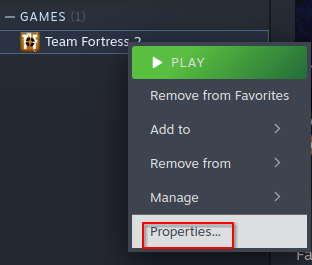

# :fontawesome-brands-linux: Running on Linux


??? abstract "TF2 Linux Beta"
    There is currently a 64-bit TF2 Linux beta, however it can't connect to servers or matchmake.


## :material-package-variant-plus: Installing prerequisites

!!! note
    The following is for if the game does not load normally.

We need to install [`lib32-gperftools`](https://aur.archlinux.org/packages/lib32-gperftools) (or [`google-perftools`](https://packages.debian.org/stable/google-perftools)) to be able to run the current 32-bit build of TF2 on Linux.

### :material-arch: Arch

```bash

paru -S lib32-gperftools

```
or 

```bash

yay -S lib32-gperftools

```

### :material-debian: Ubuntu/Debian

```

sudo apt install google-perftools

```


### :material-fedora: Fedora

```

sudo dnf install gperftools-devel.i686

```


## :material-steam: Changing Steam Options

Go to Team Fortress 2 in your [Steam Library](steam://open/games), right click it and choose **Properties**. 



Under **Launch Options**, add this:

```

LD_PRELOAD=/usr/lib32/libtcmalloc.so:$LD_PRELOAD %command% -novid

```

!!! info "The file may also be in `/usr/lib`, depending on distro."

You may need to open it a few times to get it to work.


------

[Thanks ProtonDB!](https://www.protondb.com/app/440)
